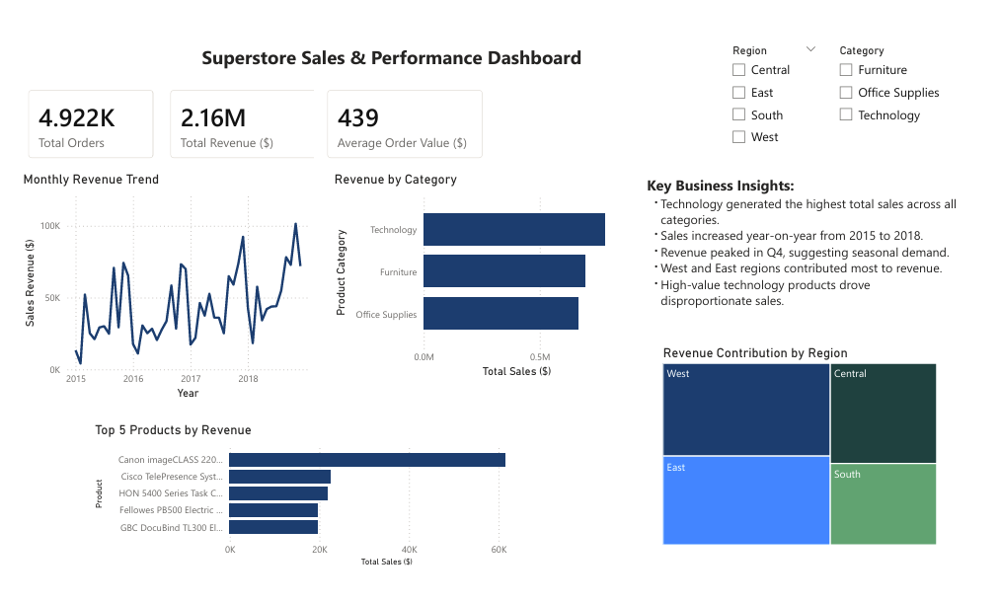

# Superstore-Data-Cleaning-and-Analysis

## Project Overview

This project focuses on cleaning, transforming, analysing, and visualising retail sales data using PostgreSQL and Power BI.

The dataset was initially imported as raw CSV data containing inconsistent formatting, missing values, mixed date formats, and data quality issues. A full SQL data cleaning workflow was applied before conducting business analysis and building an interactive Power BI dashboard.

The final dashboard provides insights into:

* Sales performance over time
* Regional sales contribution
* Product category performance
* Top-performing products
* Customer purchasing behaviour
* Shipping performance

---

## Tools & Technologies

* PostgreSQL
* pgAdmin 4
* Power BI
* SQL

---

## Data Cleaning Process

The following cleaning and transformation steps were completed in PostgreSQL:

* Standardised inconsistent text casing
* Converted blank strings to NULL values
* Standardised date formats
* Cleaned currency-formatted sales values
* Converted sales data to numeric datatype
* Renamed columns using snake_case convention
* Identified duplicate rows for review
* Standardised shipping mode categories
* Preserved unresolved NULL values where accurate replacement was not possible

---

## Business Analysis Performed

The project includes SQL analysis focused on answering business-driven questions such as:

1. Which product categories generate the highest revenue?
2. Which products contribute the most sales?
3. Which regions contribute the highest share of revenue?
4. How do sales trends change over time?
5. Which shipping methods are the most efficient?
6. What is the average order value?
7. How has yearly sales growth changed over time?
8. Which states generate the highest sales revenue?
9. How has category performance changed over time?

---

## Dashboard Features

The Power BI dashboard includes:

* KPI cards for total sales, total orders, and average order value
* Monthly sales trend analysis
* Sales breakdown by category
* Regional sales contribution analysis
* Top-performing product analysis
* Interactive slicers for category and region filtering

---

## Key Insights

* Technology generated the highest total sales revenue.
* Sales consistently increased between 2015 and 2018.
* Revenue peaked during Q4 each year, particularly in November and December.
* West and East regions contributed the majority of company revenue.
* Premium office technology products generated disproportionately high sales.
* Standard Class shipping showed the longest average delivery time.

---

## Dashboard 

---

## Project Outcome

This project demonstrates an end-to-end data analytics workflow involving:

* Data cleaning
* Data transformation
* SQL business analysis
* KPI development
* Dashboard design
* Business storytelling

The project was built as part of a personal data analytics portfolio.
